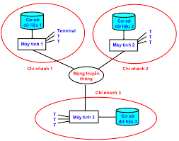

<!-- 🌐 Banner mở đầu cho README -->
<div align="center">

  <!-- Tiêu đề -->
  <h2>🚀 ĐỒ ÁN: CƠ SỞ DỮ LIỆU PHÂN TÁN (SGU)</h2>
  <p><i>Xây dựng, phân tích và mô phỏng hệ CSDL phân tán trên nhiều nền tảng</i></p>

  <!-- Badges -->
  <p>
    
    
    
    
    
  </p>

  <!-- Bảng logo -->
  <table>
    <tr>
      <!-- SQL Server -->
      <td align="center" width="140">
        <br>
        <sub><b>Microsoft SQL Server</b></sub>
      </td>
      <!-- Hadoop -->
      <td align="center" width="140">
        <br>
        <sub><b>Hadoop Ecosystem</b></sub>
      </td>
      <!-- SGU (center) -->
      <td align="center" width="200">
        <br>
        <sub><b>Đại học Sài Gòn (SGU)</b></sub>
      </td>
      <!-- AWS -->
      <td align="center" width="140">
        <br>
        <sub><b>Amazon Web Services</b></sub>
      </td>
      <!-- Mô hình phân tán -->
      <td align="center" width="140">
        <br>
        <sub><b>Mô hình CSDL Phân Tán</b></sub>
      </td>
    </tr>
  </table>

  <!-- Phân cách -->
  <br>
  

  <hr style="width:60%; border: 1px solid #eee;">

  <!-- Thông tin lớp / mô tả -->
  <p>
    📚 <b>Khoa Công nghệ Thông tin</b> • Trường Đại học Sài Gòn (SGU) <br>
    🧪 Môn học: <b>Cơ sở dữ liệu phân tán</b> • Học phần thực hành
  </p>
</div>

---

## 📑 MỤC LỤC

1. [🚀 Giới thiệu tổng quan](#-giới-thiệu-tổng-quan)
2. [🏆 Thành tích nổi bật](#-thành-tích-nổi-bật)
3. [📂 Cấu trúc nội dung repo](#-cấu-trúc-nội-dung-repo)
4. [🎯 Mục tiêu của repo](#-mục-tiêu-của-repo)
5. [🌐✨ Liên kết tài nguyên](#-liên-kết-tài-nguyên)
6. [🏫 Thông tin chung](#-thông-tin-chung)
7. [📘 Tổng quan về đồ án lớp DCT122C3](#2-tổng-quan-về-đồ-án-lớp-dct122c3)
   - [🧩 Phần 1 – Đồ án chung (SQL Server – Hệ thống quản lý quỹ)](#-phần-1--đồ-án-chung-sql-server--hệ-thống-quản-lý-quỹ)
   - [💡 Phần 2 – Đồ án riêng (Chuyên đề mở rộng CSDL phân tán)](#-phần-2--đồ-án-riêng-chuyên-đề-mở-rộng-csdl-phân-tán)
8. [🗃️ Tóm tắt Đồ án chung – SQL Server](#4-tóm-tắt-đồ-án-chung--sql-server-fundmanagement)
9. [🧠 Đồ án riêng – Hadoop & MapReduce](#5-đồ-án-riêng--hadoop--mapreduce-)
10. [🔄 Liên hệ giữa hai phần](#-liên-hệ-giữa-hai-phần)
11. [🏁 Kết quả & Đánh giá](#-kết-quả--đánh-giá)
12. [👨‍💻 Tác giả](#-tác-giả)
13. [⚖️ License](#-license)

---

# 📘 ĐỒ ÁN CƠ SỞ DỮ LIỆU PHÂN TÁN & KHO TÀI LIỆU CHUYÊN SÂU MÔN CSDL PHÂN TÁN – SGU  
> Tổng hợp và hệ thống hóa kiến thức – từ **lý thuyết phân tán** đến **triển khai thực tế**.

---

## 🧩 Giới thiệu tổng quan

Đây là **tài liệu và đồ án tổng hợp** cho môn *Cơ Sở Dữ Liệu Phân Tán* của **lớp DCT122C3 – Đại học Sài Gòn (SGU)**.  
Repo này được biên soạn dựa trên **kinh nghiệm thực hành – nghiên cứu – triển khai** từ các nguồn **trong nước và quốc tế**, nhằm mang đến **một góc nhìn vừa sâu về lý thuyết, vừa chi tiết về thực tế triển khai**.

---

## 🏆 Thành tích nổi bật

✨ **Nhóm 11 (Trương Phú Kiệt – Trà Đức Toàn)** đạt **điểm 9.5/10**,  
là **điểm cao nhất lớp DCT122C3**, với phần **đồ án riêng Hadoop & MapReduce** – được đánh giá xuất sắc về:
- ✅ **Hiểu rõ cơ chế hoạt động của Hadoop Ecosystem (HDFS, YARN, MapReduce)**.  
- ⚙️ **Triển khai thực tế cluster phân tán trên local, Docker và AWS Cloud.**  
- 💡 **Phân tích – so sánh – đánh giá hiệu năng dựa trên lý thuyết và thực nghiệm.**

---

## 📂 Cấu trúc nội dung repo

> Repo này kết hợp **3 tài liệu trọng tâm**, được chọn lọc và tái biên soạn nhằm giúp người đọc  
> **vừa nắm chắc lý thuyết phân tán**, **vừa có thể tự triển khai thực hành** theo từng bước.

1. **🗃️ Đồ án chung CSDLPT** – *Hệ thống Quản lý Quỹ*  
   - Xây dựng hệ thống **phân mảnh – replication – đồng bộ dữ liệu** bằng **SQL Server**.  
   - Phần này mô phỏng một hệ thống tài chính thực tế, phân tán theo loại quỹ và mức rủi ro.  

2. **🧠 Đồ án riêng – Hadoop & MapReduce**  
   - Nghiên cứu và triển khai **xử lý dữ liệu lớn phân tán** trên **Hadoop Cluster**.  
   - Bao gồm cả **WordCount Demo**, **HDFS CLI**, **YARN job monitoring**, **Docker** & **AWS Deployment**.  
   - Là **đề tài được đánh giá cao nhất lớp (9.5/10)**.  

3. **🎞️ Slide thuyết trình tổng hợp**  
   - Hệ thống hóa toàn bộ kiến thức từ **HDFS – YARN – MapReduce – SQL Replication**.  
   - Giúp người đọc nắm được mối quan hệ giữa **CSDL phân tán truyền thống và Big Data hiện đại**.

---

## 🎯 Mục tiêu của repo

- Cung cấp **tài liệu chi tiết về cách cài đặt, cấu hình, và triển khai hệ thống CSDL phân tán**.  
- Giúp sinh viên **hiểu sâu bản chất lý thuyết** (phân mảnh, đồng bộ, tính nhất quán, xử lý song song).  
- Làm cầu nối giữa **kiến thức học thuật SGU** và **ứng dụng thực tiễn trong ngành IT**.  
- Trở thành **nguồn tham khảo toàn diện** cho các bạn học cùng khóa hoặc sinh viên nghiên cứu về CSDL phân tán.

---

> 💬 *“Chúng tôi không chỉ chạy được chương trình – mà còn hiểu sâu lý do vì sao nó chạy được.”*  
> — **Nhóm 11, Lớp DCT122C3, Đại học Sài Gòn**

---
## 🌐✨ Liên kết tài nguyên

<div align="center">

🎓 **Tài liệu học phần – Cơ Sở Dữ Liệu Phân Tán (Lớp DCT122C3 – Đại học Sài Gòn)**  

<h2 align="center">
  
</h2>

---

## 💾 Kho tài liệu huyền thoại – DCT122C3 📚

Bạn có bao giờ muốn **xem toàn bộ đồ án, slide và báo cáo** của một lớp *Cơ sở dữ liệu phân tán* đầy đủ nhất chưa?  
Từ những bài cài đặt **SQL Server Replication** chi tiết, cho đến các đề tài đặc biệt như  
**Hadoop – MapReduce, Talend, PostgreSQL, Oracle, MySQL, Blockchain...**

> Tất cả được nhóm lại trong **một thư mục Google Drive duy nhất** –  
> nơi chứa đựng “**kho tri thức thực chiến**” của cả lớp DCT122C3 – Đại học Sài Gòn 💡  

📁 [](https://drive.google.com/drive/folders/1huLhz03fFSucvnEqQ9PsZSp-jgrxtE8J)

💻 **GitHub cá nhân – Trương Phú Kiệt**  
[](https://github.com/Kietnehi)

---

### 🧩 **Tổng hợp 9 đề tài nổi bật trong kho tài liệu**

| 🔢 | 🧠 Chủ đề | 💡 Mô tả ngắn gọn |
|:--:|:-----------|:------------------|
| 🏛️ | **Đồ án chung – SQL Server Replication** | Xây dựng hệ thống **Quản lý Quỹ Phân Tán**, thiết kế **phân mảnh dữ liệu** theo RiskProfile & FundType, và triển khai **Merge Publication** giữa nhiều site. |
| 1️⃣ | **Liên thông Oracle ↔ SQL Server** | Thiết lập **Linked Server** và **ODBC Connection** để trao đổi dữ liệu giữa 2 hệ quản trị CSDL khác nhau. |
| 2️⃣ | **Liên thông MySQL ↔ SQL Server** | Kết nối chéo thông qua **MySQL Connector/ODBC**, tạo view tổng hợp liên hệ giữa 2 nền tảng. |
| 3️⃣ | **Liên thông PostgreSQL ↔ MySQL** | Dùng **Foreign Data Wrapper (FDW)** trong PostgreSQL để truy xuất dữ liệu MySQL từ xa. |
| 4️⃣ | **Di trú dữ liệu bằng Talend** | Thiết kế luồng **ETL (Extract – Transform – Load)** giữa các hệ thống CSDL khác nhau bằng công cụ **Talend Open Studio**. |
| 5️⃣ | **Di trú dữ liệu khác cấu trúc lược đồ** | Chuyển đổi dữ liệu giữa các hệ thống **không tương thích schema**, kết hợp mapping tự động và chuẩn hóa dữ liệu. |
| 6️⃣ | **Cơ sở dữ liệu phi tập trung (Decentralized DB)** | Tìm hiểu mô hình **blockchain database**, cơ chế đồng thuận và quản lý node phân tán. |
| 7️⃣ | **Hadoop & MapReduce (Trương Phú Kiệt – điểm 9.5/10)** 🏆 | Triển khai **HDFS – YARN – MapReduce**, thực nghiệm **WordCount** trên cluster local, Docker & AWS, đo hiệu năng theo node. |
| 8️⃣ | **PostgreSQL Distributed System** | Cài đặt **PostgreSQL Cluster**, cấu hình **phân mảnh và đồng bộ dữ liệu** trên hệ thống quản lý quỹ. |

---

### 🎤 **Kho slide thuyết trình & tài liệu bổ trợ**

Ngoài các file báo cáo chính, thư mục này còn bao gồm:
- 🧱 **Slide đồ án chung:** giới thiệu tổng quan về hệ thống quản lý quỹ, kiến trúc phân tán, replication, và minh họa demo thực tế trên SQL Server.  
- 💡 **Slide của 8 đề tài riêng:** mỗi đề tài có **slide trình bày + hướng dẫn cài đặt + ví dụ thực hành**.  
- 🖼️ **Ảnh chụp kết quả thực nghiệm:** cấu hình replication, chạy job MapReduce, cấu trúc cluster Hadoop, v.v.  
- 📘 **Tài liệu PDF & Word:** đầy đủ phần mô tả kỹ thuật, ERD, kịch bản phân tán, và lược đồ dữ liệu.  

---

⭐ *Khám phá kho tài liệu này để hiểu sâu hơn về cách triển khai, phân mảnh và xử lý dữ liệu phân tán trong thực tế.*  
> Một nguồn tham khảo quý giá cho mọi sinh viên IT đang học về **Cơ sở dữ liệu phân tán & Big Data** 🚀  

</div>


---

<div align="center">

<h2>🏫 <b>THÔNG TIN CHUNG</b></h2>

<table border="0" cellspacing="0" cellpadding="6">
  <tr>
    <td align="left" style="font-size: 18px;">
      <b>🏛️ Trường:</b> Trường Đại học Sài Gòn  
    </td>
  </tr>
  <tr>
    <td align="left" style="font-size: 18px;">
      <b>💻 Khoa:</b> Công nghệ Thông tin  
    </td>
  </tr>
  <tr>
    <td align="left" style="font-size: 18px;">
      <b>📘 Môn học:</b> Cơ sở dữ liệu phân tán  
    </td>
  </tr>
  <tr>
    <td align="left" style="font-size: 18px;">
      <b>👨‍🏫 Giảng viên hướng dẫn:</b> <b>TS.Nguyễn Quốc Huy</b>  
    </td>
  </tr>
  <tr>
    <td align="left" style="font-size: 18px;">
      <b>🧩 Lớp:</b> <b>DCT122C3</b>  
    </td>
  </tr>
  <tr>
    <td align="left" style="font-size: 18px;">
      <b>👥 Nhóm thực hiện:</b> <b>Nhóm 11</b>  
      <ul style="font-size: 17px; text-align: left;">
        <li>Trà Đức Toàn – 3122411217</li>
        <li>Trương Phú Kiệt – 3122411109</li>
      </ul>
    </td>
  </tr>
  <tr>
    <td align="left" style="font-size: 18px;">
      <b>🗓️ Thời gian:</b> <i>Thành phố Hồ Chí Minh, tháng 3 năm 2025</i>  
    </td>
  </tr>
</table>

</div>

---


## 2. Tổng quan về đồ án lớp DCT122C3

Cả lớp DCT122C3 được chia thành **2 phần đồ án chính**:

### 🧩 Phần 1 – Đồ án chung (SQL Server – Hệ thống quản lý quỹ)

Tất cả sinh viên đều cùng thực hiện một đề tài **xây dựng hệ thống CSDL phân tán bằng SQL Server**.  
Bao gồm:
- Thiết kế cơ sở dữ liệu **FundManagement**.
- Cấu hình **Replication** (Publisher – Distributor – Subscriber).  
- Phân mảnh dữ liệu theo **RiskProfile** (Low/Medium/High) hoặc **FundType**.
- Triển khai trên nhiều instance SQL Server, thực hiện truy vấn phân tán.

### 💡 Phần 2 – Đồ án riêng (Chuyên đề mở rộng CSDL phân tán)

Mỗi nhóm chọn một chủ đề nâng cao để nghiên cứu riêng.  
Danh sách các chủ đề của lớp gồm:

1. Liên thông Database **Oracle ↔ SQL Server**  
2. Liên thông **MySQL ↔ SQL Server**  
3. Liên thông **PostgreSQL ↔ MySQL**  
4. **Di trú dữ liệu** sử dụng **Talend**  
5. Di trú dữ liệu **khác cấu trúc lược đồ**  
6. **Cơ sở dữ liệu phi tập trung (Blockchain Database)**  
7. **Hadoop & MapReduce** 🏆 *(Chủ đề của Trương Phú Kiệt và Trà Đức Toàn – đạt điểm cao nhất lớp: **9.5/10**)*
8. **Phân tán dữ liệu trong PostgreSQL** (trên hệ thống quản lý quỹ)

---

## 3. Mục tiêu README

README này được tạo ra để:
1. Gom toàn bộ nội dung đồ án chung và đồ án riêng trong **một tài liệu duy nhất**.  
2. Tái hiện **cấu trúc thư mục**, **cách triển khai**, **lệnh chạy** và **giải thích logic phân tán**.  
3. Phục vụ cho việc **đưa lên GitHub** hoặc **nộp file tổng hợp** cho giảng viên.

---


## 4. Tóm tắt Đồ án chung – SQL Server (FundManagement)

### 🎯 Mục tiêu
Xây dựng hệ thống **FundManagement** phục vụ việc quản lý quỹ đầu tư,  
sau đó **phân tán dữ liệu** qua nhiều site SQL Server để:
- Giảm tải cho từng node.
- Dự phòng dữ liệu khi lỗi.
- Cho phép xử lý song song.

### ⚙️ Phân mảnh và Replication
- **Phân mảnh bảng `Clients`** theo `RiskProfile` (`Low`, `Medium`, `High`).  
- **Phân mảnh bảng `Funds`** theo `FundType` (`Equity`, `Bond`, `Mixed`).  
- **Replication dạng Merge Publication** để đồng bộ 2 chiều.  
- **Linked Server** dùng để hợp nhất truy vấn toàn cục.

---

## 5. Đồ án riêng – Hadoop & MapReduce 🧠  

> **Chủ đề của Trương Phú Kiệt – đạt điểm 9.5/10 (cao nhất lớp).**

### 🔍 Mục tiêu
Tìm hiểu cơ chế lưu trữ và xử lý dữ liệu phân tán trên **Hadoop Ecosystem**,  
bao gồm **HDFS**, **YARN** và **MapReduce**,  
so sánh hiệu năng giữa các môi trường **local, Docker, AWS**.

### ⚡ Thực nghiệm chính
- Viết chương trình **WordCount**.
- Triển khai 4 môi trường:
  1. Python tuần tự  
  2. Hadoop Single Node  
  3. Hadoop Docker 3 Node  
  4. Hadoop AWS Cluster  
- Kết quả: **số node càng nhiều → tốc độ xử lý càng nhanh**.

### 📦 Các lệnh cơ bản HDFS
```bash
hdfs dfs -mkdir /input
hdfs dfs -put data.txt /input
hadoop jar hadoop-mapreduce-examples-3.3.0.jar wordcount /input /output
hdfs dfs -cat /output/part-r-00000
```

---

## 🔄 6. Liên hệ giữa hai phần

| ⚙️ **So sánh** | 🧩 **SQL Server (Replication)** | ☁️ **Hadoop (MapReduce)** |
|:---------------|:-------------------------------|:--------------------------|
| 🎯 **Mục tiêu** | Phân tán dữ liệu nghiệp vụ | Phân tán xử lý dữ liệu lớn |
| 🧠 **Cơ chế hoạt động** | Publisher → Distributor → Subscriber | HDFS → YARN → MapReduce |
| 🗂️ **Loại dữ liệu** | Có cấu trúc, giao dịch | Phi cấu trúc, log, văn bản lớn |
| ⏱️ **Đồng bộ** | Gần real-time / Replication liên tục | Batch Processing theo Job |
| 💻 **Ngôn ngữ / Công cụ** | SQL / T-SQL, Linked Server, Replication Agent | Java / Python, HDFS CLI, Yarn ResourceManager |
| 💼 **Ứng dụng thực tế** | Quản lý quỹ, ngân hàng, hệ thống ERP | Phân tích log, Big Data, Machine Learning, ETL |

> 🧩 Cả hai mô hình đều **thuộc lĩnh vực phân tán**, nhưng mục tiêu khác nhau:  
> - **SQL Server** → hướng tới **tính nhất quán và đồng bộ dữ liệu nghiệp vụ**.  
> - **Hadoop** → tối ưu **xử lý dữ liệu lớn song song và chịu lỗi**.

---

## 🏁 7. Kết quả & Đánh giá

### 🎓 **Đồ án chung – SQL Server (Quản lý Quỹ Phân Tán)**
- ✅ Hoàn thiện **thiết kế CSDL & phân mảnh** (RiskProfile, FundType).  
- 🔁 Cấu hình **Merge Replication** giữa nhiều server instance.  
- 🧩 Thực hiện **linked server queries** để hợp nhất dữ liệu toàn hệ thống.  
- 🧠 Kết quả: **chạy ổn định, đồng bộ dữ liệu nhanh, không lỗi transaction.**

### ⚡ **Đồ án riêng – Hadoop & MapReduce (Trương Phú Kiệt)**
- ⚙️ Cài đặt thành công **cluster Hadoop** (local → Docker → AWS).  
- 🧾 Chạy và so sánh hiệu năng bài toán **WordCount** trên nhiều môi trường.  
- 📊 Kết quả thực nghiệm: **số node càng nhiều → tốc độ xử lý càng cao.**  
- 🏆 **Điểm đánh giá: 9.5 / 10 – Cao nhất lớp DCT122C3.**

---

## 👨‍💻 8. Tác giả

| 🧑‍🎓 Thành viên | 🎯 Mã số sinh viên | 📬 Liên hệ |
|:----------------|:------------------|:-----------|
| **Trà Đức Toàn** | 3122411217 | — |
| **Trương Phú Kiệt** *(Chủ đề Hadoop & MapReduce)* | 3122411109 | [GitHub – Kietnehi](https://github.com/Kietnehi) |

> 📚 **Lớp**: DCT122C3 – **Đại học Sài Gòn, Khoa CNTT**  
> ✨ *Đồ án đạt điểm xuất sắc và được đánh giá cao về tính thực tiễn & trình bày.*

---

## ⚖️ 9. License

📖 Tài liệu này được biên soạn nhằm mục đích **học tập và chia sẻ kiến thức** trong môn *Cơ Sở Dữ Liệu Phân Tán* tại **Đại học Sài Gòn**.  
Bạn có thể **sử dụng, trích dẫn hoặc cải tiến** với mục đích học thuật.  

> 💡 Hãy giữ lại tên tác giả khi trích dẫn để tôn trọng công sức học tập của nhóm.

---

<div align="center">
  
✨ *“Phân tán dữ liệu – Kết nối tri thức.”* ✨  

</div>
