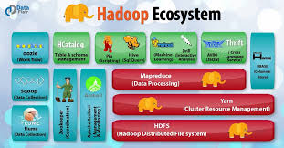
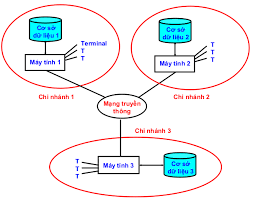

---

<div align="center">

<h2>🚀 PROJECT: DISTRIBUTED DATABASE SYSTEMS (SGU)</h2>
<p><i>Building, analyzing, and simulating distributed database systems on multiple platforms</i></p>

<p>


</p>

<table>
<tr>
<td align="center" width="140">


<sub><b>Microsoft SQL Server</b></sub>
</td>
<td align="center" width="140">



<sub><b>Hadoop Ecosystem</b></sub>
</td>
<td align="center" width="200">


<sub><b>Saigon University (SGU)</b></sub>
</td>
<td align="center" width="140">


<sub><b>Amazon Web Services</b></sub>
</td>
<td align="center" width="140">



<sub><b>Distributed DB Model</b></sub>
</td>
</tr>
</table>

<hr style="width:60%; border: 1px solid #eee;">

<p>
📚 <b>Faculty of Information Technology</b> • Saigon University (SGU) 


🧪 Subject: <b>Distributed Database Systems</b> • Practical Module
</p>
</div>

---

## 📚 TABLE OF CONTENTS

* [🚀 General Introduction](https://www.google.com/search?q=%23-general-introduction)
* [🏆 Key Achievements](https://www.google.com/search?q=%23-key-achievements)
* [📂 Repo Structure](https://www.google.com/search?q=%23-repo-structure)
* [🎯 Project Goals](https://www.google.com/search?q=%23-project-goals)
* [🌐✨ Resource Links](https://www.google.com/search?q=%23-resource-links)
* [🏫 General Information](https://www.google.com/search?q=%23-general-information)
* [📘 Project Overview - Class DCT122C3](https://www.google.com/search?q=%232-project-overview---class-dct122c3)
* [🧩 Part 1 – General Project (SQL Server – Fund Management System)](https://www.google.com/search?q=%23-part-1--general-project-sql-server--fund-management-system)
* [💡 Part 2 – Specialized Project (Advanced Distributed DB Topics)](https://www.google.com/search?q=%23-part-2--specialized-project-advanced-distributed-db-topics)


* [🗃️ General Project Summary – SQL Server](https://www.google.com/search?q=%234-general-project-summary--sql-server-fundmanagement)
* [🧠 Specialized Project – Hadoop & MapReduce](https://www.google.com/search?q=%235-specialized-project--hadoop--mapreduce-)
* [🔄 Connection Between Both Parts](https://www.google.com/search?q=%236-connection-between-both-parts)
* [🏁 Results & Evaluation](https://www.google.com/search?q=%237-results--evaluation)
* [👨‍💻 Authors](https://www.google.com/search?q=%238-authors)
* [⚖️ License](https://www.google.com/search?q=%239-license)

---

# 📘 DISTRIBUTED DATABASE PROJECT & ADVANCED RESOURCE REPOSITORY – SGU

> Synthesizing and systematizing knowledge – from **distributed theory** to **practical implementation**.

---

## 🧩 General Introduction

This is a **comprehensive document and project repository** for the *Distributed Database Systems* subject of **Class DCT122C3 – Saigon University (SGU)**.

This repo is compiled based on **practical experience, research, and deployment** from both **domestic and international sources**, aiming to provide **a deep theoretical perspective alongside detailed practical implementation**.

---

## 🏆 Key Achievements

✨ **Group 11 (Truong Phu Kiet – Tra Duc Toan)** achieved a **score of 9.5/10**,

which was the **highest score in class DCT122C3**, with the **Specialized Hadoop & MapReduce Project** – rated excellent for:

* ✅ **Deep understanding of the Hadoop Ecosystem mechanisms (HDFS, YARN, MapReduce)**.
* ⚙️ **Practical deployment of a distributed cluster on local machines, Docker, and AWS Cloud.** - 💡 **Analysis – Comparison – Performance evaluation based on theory and experimentation.**

---

## 📂 Repo Structure

> This repo combines **3 core documents**, selected and re-edited to help readers
> **solidify theoretical knowledge** while **implementing practical steps**.

1. **🗃️ General Project** – *Fund Management System* - Building a system for **fragmentation – replication – data synchronization** using **SQL Server**.
* This part simulates a real-world financial system, distributed by fund type and risk level.


2. **🧠 Specialized Project – Hadoop & MapReduce** - Research and implementation of **distributed big data processing** on a **Hadoop Cluster**.
* Includes **WordCount Demo**, **HDFS CLI**, **YARN job monitoring**, **Docker** & **AWS Deployment**.
* This was the **highest-rated topic in the class (9.5/10)**.


3. **🎞️ Comprehensive Presentation Slides** - Systematizing all knowledge from **HDFS – YARN – MapReduce – SQL Replication**.
* Helping readers understand the relationship between **traditional Distributed Databases and modern Big Data**.


---

## 🎯 Project Goals

* Provide **detailed documentation on installation, configuration, and deployment of distributed database systems**.
* Help students **deeply understand theoretical essence** (fragmentation, synchronization, consistency, parallel processing).
* Bridge the gap between **SGU academic knowledge** and **practical application in the IT industry**.
* Become a **comprehensive reference source** for classmates or students researching distributed databases.

---

> 💬 *“We don't just run the program – we deeply understand why it runs.”* > — **Group 11, Class DCT122C3, Saigon University**

---

## 🌐✨ Resource Links

<div align="center">

🎓 **Course Materials – Distributed Database Systems (Class DCT122C3 – Saigon University)**

<h2>
  
</h2>

</div>

---

## 💾 The Legendary Repository – DCT122C3 📚


Have you ever wanted to **view the complete projects, slides, and reports** of a *Distributed Database Systems* class in one place?

From detailed **SQL Server Replication** setup guides to advanced topics such as

**Hadoop – MapReduce, Talend, PostgreSQL, Oracle, MySQL, Blockchain...**

> Everything is grouped into **a single Google Drive folder** –  
> a place that contains the “**combat-ready knowledge base**” of the entire DCT122C3 class – Saigon University 💡  

<br/>
<div align="center">

📁  
[](https://drive.google.com/drive/folders/1huLhz03fFSucvnEqQ9PsZSp-jgrxtE8J)

<br/>

💻 **Personal GitHub – Truong Phu Kiet**  

[](https://github.com/Kietnehi)

</div>


---

### 🧩 **Summary of 9 Outstanding Topics in the Repository**

| 🔢 | 🧠 Topic | 💡 Brief Description |
| --- | --- | --- |
| 🏛️ | **General Project – SQL Server Replication** | Building a **Distributed Fund Management** system, designing **data fragmentation** by RiskProfile & FundType, and implementing **Merge Publication** across multiple sites. |
| 1️⃣ | **Oracle ↔ SQL Server Interconnection** | Setting up **Linked Server** and **ODBC Connection** to exchange data between two different DBMS. |
| 2️⃣ | **MySQL ↔ SQL Server Interconnection** | Cross-connection via **MySQL Connector/ODBC**, creating views to synthesize links between 2 platforms. |
| 3️⃣ | **PostgreSQL ↔ MySQL Interconnection** | Using **Foreign Data Wrapper (FDW)** in PostgreSQL to query remote MySQL data. |
| 4️⃣ | **Data Migration with Talend** | Designing **ETL (Extract – Transform – Load)** flows between different database systems using **Talend Open Studio**. |
| 5️⃣ | **Heterogeneous Schema Data Migration** | Converting data between systems with **incompatible schemas**, combining automatic mapping and data normalization. |
| 6️⃣ | **Decentralized Database (Blockchain DB)** | Exploring the **blockchain database** model, consensus mechanisms, and distributed node management. |
| 7️⃣ | **Hadoop & MapReduce (Truong Phu Kiet – Score 9.5/10)** 🏆 | Deploying **HDFS – YARN – MapReduce**, experimenting with **WordCount** on local, Docker & AWS clusters, measuring performance by node. |
| 8️⃣ | **PostgreSQL Distributed System** | Installing **PostgreSQL Cluster**, configuring **fragmentation and data synchronization** on the fund management system. |

---

### 🎤 **Presentation Slides & Supplementary Materials**

In addition to the main report files, this folder includes:

* 🧱 **General Project Slides:** Overview of the fund management system, distributed architecture, replication, and practical demos on SQL Server.
* 💡 **Slides for 8 Specialized Topics:** Each topic includes **presentation slides + installation guides + practical examples**.
* 🖼️ **Experimental Result Screenshots:** Replication configuration, MapReduce job execution, Hadoop cluster structure, etc.
* 📘 **PDF & Word Documents:** Complete technical descriptions, ERDs, distribution scenarios, and data schemas.

---

⭐ *Explore this repository to gain a deeper understanding of how to deploy, fragment, and process distributed data in reality.* > A valuable reference source for every IT student studying **Distributed Databases & Big Data** 🚀

</div>

---

<div align="center">

<h2>🏫 <b>GENERAL INFORMATION</b></h2>

<table border="0" cellspacing="0" cellpadding="6">
<tr>
<td align="left" style="font-size: 18px;">
<b>🏛️ University:</b> Saigon University (SGU)

</td>

</tr>

<tr>

<td align="left" style="font-size: 18px;">

<b>💻 Faculty:</b> Information Technology

</td>

</tr>

<tr>

<td align="left" style="font-size: 18px;">

<b>📘 Subject:</b> Distributed Database Systems

</td>

</tr>

<tr>

<td align="left" style="font-size: 18px;">

<b>👨‍🏫 Instructor:</b> <b>Dr. Nguyen Quoc Huy</b>

</td>

</tr>

<tr>

<td align="left" style="font-size: 18px;">

<b>🧩 Class:</b> <b>DCT122C3</b>

</td>

</tr>

<tr>

<td align="left" style="font-size: 18px;">

<b>👥 Team:</b> <b>Group 11</b>

<ul style="font-size: 17px; text-align: left;">

<li>Tra Duc Toan – 3122411217</li>

<li>Truong Phu Kiet – 3122411109</li>

</ul>

</td>

</tr>

<tr>

<td align="left" style="font-size: 18px;">

<b>🗓️ Time:</b> <i>Ho Chi Minh City, March 2025</i>

</td>

</tr>

</table>

</div>

---

## 2. Project Overview - Class DCT122C3

The entire DCT122C3 class was divided into **2 main project parts**:

### 🧩 Part 1 – General Project (SQL Server – Fund Management System)

All students implemented a topic on **building a distributed database system using SQL Server**.

This includes:

* Designing the **FundManagement** database.
* Configuring **Replication** (Publisher – Distributor – Subscriber).
* Fragmenting data by **RiskProfile** (Low/Medium/High) or **FundType**.
* Deploying on multiple SQL Server instances, performing distributed queries.

### 💡 Part 2 – Specialized Project (Advanced Distributed DB Topics)

Each group selected an advanced topic for independent research.

The list of topics for the class included:

1. Database Interconnection **Oracle ↔ SQL Server** 2. Interconnection **MySQL ↔ SQL Server** 3. Interconnection **PostgreSQL ↔ MySQL** 4. **Data Migration** using **Talend** 5. Data Migration with **Heterogeneous Schemas** 6. **Decentralized Database (Blockchain Database)** 7. **Hadoop & MapReduce** 🏆 *(Topic by Truong Phu Kiet and Tra Duc Toan – achieved the highest score: **9.5/10**)*
2. **Data Distribution in PostgreSQL** (on the fund management system)

---

## 3. Purpose of this README

This README was created to:

1. Consolidate all content from both the general and specialized projects into **a single document**.
2. Recreate the **folder structure**, **deployment methods**, **execution commands**, and **explanation of distributed logic**.
3. Serve the purpose of **uploading to GitHub** or **submitting the comprehensive file** to the instructor.

---

## 4. General Project Summary – SQL Server (FundManagement)

### 🎯 Goal

Build a **FundManagement** system to serve investment fund management,

then **distribute data** across multiple SQL Server sites to:

* Reduce load on individual nodes.
* Provide data redundancy in case of failure.
* Allow parallel processing.

### ⚙️ Fragmentation and Replication

* **Fragment the `Clients` table** by `RiskProfile` (`Low`, `Medium`, `High`).
* **Fragment the `Funds` table** by `FundType` (`Equity`, `Bond`, `Mixed`).
* **Merge Publication Replication** for 2-way synchronization.
* **Linked Server** used to consolidate global queries.

---

## 5. Specialized Project – Hadoop & MapReduce 🧠

> **Topic by Truong Phu Kiet – achieved a score of 9.5/10 (Highest in Class).**

### 🔍 Goal

Understand the mechanism of distributed storage and processing on the **Hadoop Ecosystem**,

including **HDFS**, **YARN**, and **MapReduce**,

comparing performance between **local, Docker, and AWS** environments.

### ⚡ Key Experiments

* Write a **WordCount** program.
* Deploy in 4 environments:
1. Sequential Python
2. Hadoop Single Node
3. Hadoop Docker 3 Nodes
4. Hadoop AWS Cluster


* Result: **More nodes → faster processing speed**.

### 📦 Basic HDFS Commands

```bash
hdfs dfs -mkdir /input
hdfs dfs -put data.txt /input
hadoop jar hadoop-mapreduce-examples-3.3.0.jar wordcount /input /output
hdfs dfs -cat /output/part-r-00000

```

---

## 6. Connection Between Both Parts

| ⚙️ **Comparison** | 🧩 **SQL Server (Replication)** | ☁️ **Hadoop (MapReduce)** |
| --- | --- | --- |
| 🎯 **Goal** | Distribute operational data | Distribute big data processing |
| 🧠 **Mechanism** | Publisher → Distributor → Subscriber | HDFS → YARN → MapReduce |
| 🗂️ **Data Type** | Structured, transactional | Unstructured, logs, large text |
| ⏱️ **Sync** | Near real-time / Continuous Replication | Batch Processing by Job |
| 💻 **Language / Tool** | SQL / T-SQL, Linked Server, Replication Agent | Java / Python, HDFS CLI, Yarn ResourceManager |
| 💼 **Real-world App** | Fund management, Banking, ERP systems | Log analysis, Big Data, Machine Learning, ETL |

> 🧩 Both models **belong to the distributed field**, but have different objectives:
> * **SQL Server** → aims for **consistency and operational data synchronization**.
> * **Hadoop** → optimizes for **parallel big data processing and fault tolerance**.
> 
> 

---

## 7. Results & Evaluation

### 🎓 **General Project – SQL Server (Distributed Fund Management)**

* ✅ Completed **DB design & fragmentation** (RiskProfile, FundType).
* 🔁 Configured **Merge Replication** between multiple server instances.
* 🧩 Executed **linked server queries** to consolidate system-wide data.
* 🧠 Result: **Stable operation, fast data synchronization, no transaction errors.**

### ⚡ **Specialized Project – Hadoop & MapReduce (Truong Phu Kiet)**

* ⚙️ Successfully installed **Hadoop cluster** (local → Docker → AWS).
* 🧾 Ran and compared performance of the **WordCount** problem across multiple environments.
* 📊 Experimental result: **More nodes → higher processing speed.** - 🏆 **Evaluation Score: 9.5 / 10 – Highest in Class DCT122C3.**

---

## 8. Authors

| 🧑‍🎓 Member | 🎯 Student ID | 📬 Contact |
| --- | --- | --- |
| **Tra Duc Toan** | 3122411217 | — |
| **Truong Phu Kiet** *(Hadoop & MapReduce Topic)* | 3122411109 | [GitHub – Kietnehi](https://github.com/Kietnehi) |

> 📚 **Class**: DCT122C3 – **Saigon University, Faculty of IT** > ✨ *Project achieved excellent scores and was highly rated for practicality & presentation.*

---

## 9. License

📖 This document is compiled for **educational and knowledge-sharing purposes** in the *Distributed Database Systems* subject at **Saigon University**.

You may **use, cite, or improve** it for academic purposes.

> 💡 Please credit the authors when citing to respect the team's academic efforts.

---

<div align="center">

✨ *“Distributing Data – Connecting Knowledge.”* ✨

</div>


